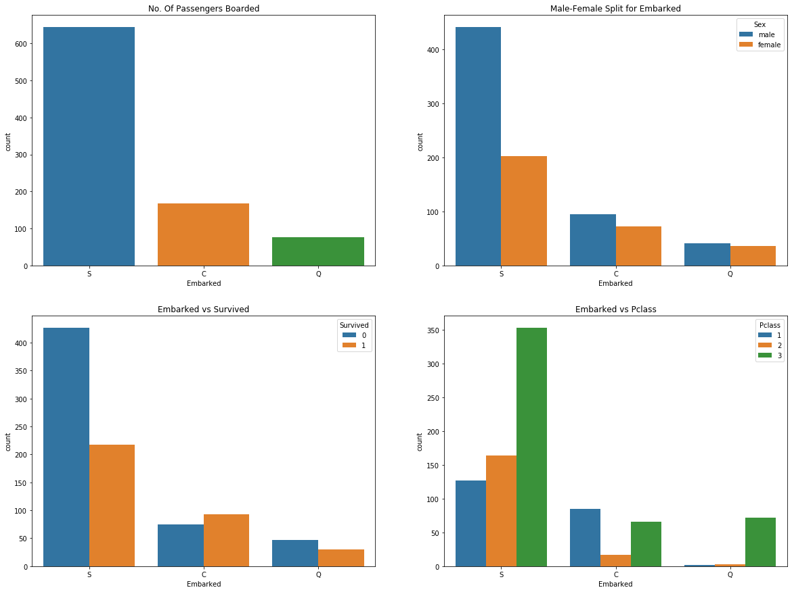
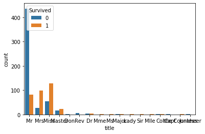
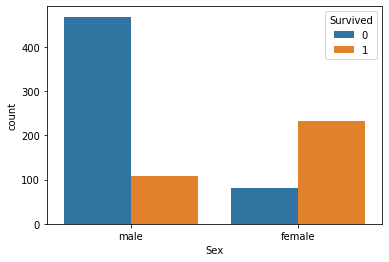
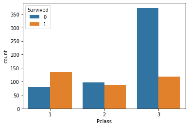
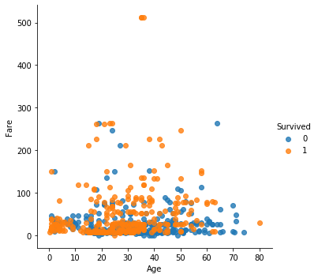
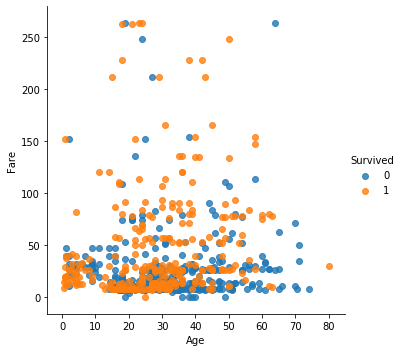
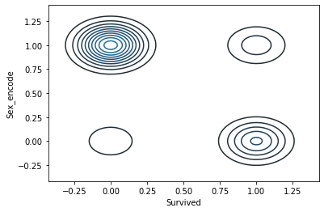
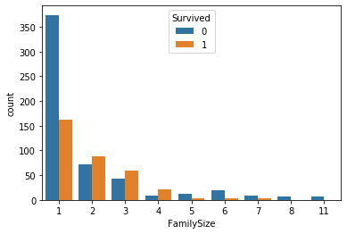

```python
import pandas as pd
%matplotlib inline
import matplotlib.pyplot as plt
import seaborn as sns
```


```python
test=pd.read_csv("C:/Users/User/Downloads/titanic/test.csv")
train=pd.read_csv("C:/Users/User/Downloads/titanic/train.csv")
```


```python
test.head()
```


<div>
<style scoped>
    .dataframe tbody tr th:only-of-type {
        vertical-align: middle;
    }

    .dataframe tbody tr th {
        vertical-align: top;
    }

    .dataframe thead th {
        text-align: right;
    }
</style>
<table border="1" class="dataframe">
  <thead>
    <tr style="text-align: right;">
      <th></th>
      <th>PassengerId</th>
      <th>Pclass</th>
      <th>Name</th>
      <th>Sex</th>
      <th>Age</th>
      <th>SibSp</th>
      <th>Parch</th>
      <th>Ticket</th>
      <th>Fare</th>
      <th>Cabin</th>
      <th>Embarked</th>
    </tr>
  </thead>
  <tbody>
    <tr>
      <td>0</td>
      <td>892</td>
      <td>3</td>
      <td>Kelly, Mr. James</td>
      <td>male</td>
      <td>34.5</td>
      <td>0</td>
      <td>0</td>
      <td>330911</td>
      <td>7.8292</td>
      <td>NaN</td>
      <td>Q</td>
    </tr>
    <tr>
      <td>1</td>
      <td>893</td>
      <td>3</td>
      <td>Wilkes, Mrs. James (Ellen Needs)</td>
      <td>female</td>
      <td>47.0</td>
      <td>1</td>
      <td>0</td>
      <td>363272</td>
      <td>7.0000</td>
      <td>NaN</td>
      <td>S</td>
    </tr>
    <tr>
      <td>2</td>
      <td>894</td>
      <td>2</td>
      <td>Myles, Mr. Thomas Francis</td>
      <td>male</td>
      <td>62.0</td>
      <td>0</td>
      <td>0</td>
      <td>240276</td>
      <td>9.6875</td>
      <td>NaN</td>
      <td>Q</td>
    </tr>
    <tr>
      <td>3</td>
      <td>895</td>
      <td>3</td>
      <td>Wirz, Mr. Albert</td>
      <td>male</td>
      <td>27.0</td>
      <td>0</td>
      <td>0</td>
      <td>315154</td>
      <td>8.6625</td>
      <td>NaN</td>
      <td>S</td>
    </tr>
    <tr>
      <td>4</td>
      <td>896</td>
      <td>3</td>
      <td>Hirvonen, Mrs. Alexander (Helga E Lindqvist)</td>
      <td>female</td>
      <td>22.0</td>
      <td>1</td>
      <td>1</td>
      <td>3101298</td>
      <td>12.2875</td>
      <td>NaN</td>
      <td>S</td>
    </tr>
  </tbody>
</table>
</div>


```python
train.head()
```


<div>
<style scoped>
    .dataframe tbody tr th:only-of-type {
        vertical-align: middle;
    }

    .dataframe tbody tr th {
        vertical-align: top;
    }

    .dataframe thead th {
        text-align: right;
    }
</style>
<table border="1" class="dataframe">
  <thead>
    <tr style="text-align: right;">
      <th></th>
      <th>PassengerId</th>
      <th>Survived</th>
      <th>Pclass</th>
      <th>Name</th>
      <th>Sex</th>
      <th>Age</th>
      <th>SibSp</th>
      <th>Parch</th>
      <th>Ticket</th>
      <th>Fare</th>
      <th>Cabin</th>
      <th>Embarked</th>
    </tr>
  </thead>
  <tbody>
    <tr>
      <td>0</td>
      <td>1</td>
      <td>0</td>
      <td>3</td>
      <td>Braund, Mr. Owen Harris</td>
      <td>male</td>
      <td>22.0</td>
      <td>1</td>
      <td>0</td>
      <td>A/5 21171</td>
      <td>7.2500</td>
      <td>NaN</td>
      <td>S</td>
    </tr>
    <tr>
      <td>1</td>
      <td>2</td>
      <td>1</td>
      <td>1</td>
      <td>Cumings, Mrs. John Bradley (Florence Briggs Th...</td>
      <td>female</td>
      <td>38.0</td>
      <td>1</td>
      <td>0</td>
      <td>PC 17599</td>
      <td>71.2833</td>
      <td>C85</td>
      <td>C</td>
    </tr>
    <tr>
      <td>2</td>
      <td>3</td>
      <td>1</td>
      <td>3</td>
      <td>Heikkinen, Miss. Laina</td>
      <td>female</td>
      <td>26.0</td>
      <td>0</td>
      <td>0</td>
      <td>STON/O2. 3101282</td>
      <td>7.9250</td>
      <td>NaN</td>
      <td>S</td>
    </tr>
    <tr>
      <td>3</td>
      <td>4</td>
      <td>1</td>
      <td>1</td>
      <td>Futrelle, Mrs. Jacques Heath (Lily May Peel)</td>
      <td>female</td>
      <td>35.0</td>
      <td>1</td>
      <td>0</td>
      <td>113803</td>
      <td>53.1000</td>
      <td>C123</td>
      <td>S</td>
    </tr>
    <tr>
      <td>4</td>
      <td>5</td>
      <td>0</td>
      <td>3</td>
      <td>Allen, Mr. William Henry</td>
      <td>male</td>
      <td>35.0</td>
      <td>0</td>
      <td>0</td>
      <td>373450</td>
      <td>8.0500</td>
      <td>NaN</td>
      <td>S</td>
    </tr>
  </tbody>
</table>
</div>


```python
train.shape
```


    (891, 21)


```python
test.shape
```


    (418, 11)


```python
test.describe()
```


<div>
<style scoped>
    .dataframe tbody tr th:only-of-type {
        vertical-align: middle;
    }

    .dataframe tbody tr th {
        vertical-align: top;
    }

    .dataframe thead th {
        text-align: right;
    }
</style>
<table border="1" class="dataframe">
  <thead>
    <tr style="text-align: right;">
      <th></th>
      <th>PassengerId</th>
      <th>Pclass</th>
      <th>Age</th>
      <th>SibSp</th>
      <th>Parch</th>
      <th>Fare</th>
    </tr>
  </thead>
  <tbody>
    <tr>
      <td>count</td>
      <td>418.000000</td>
      <td>418.000000</td>
      <td>332.000000</td>
      <td>418.000000</td>
      <td>418.000000</td>
      <td>417.000000</td>
    </tr>
    <tr>
      <td>mean</td>
      <td>1100.500000</td>
      <td>2.265550</td>
      <td>30.272590</td>
      <td>0.447368</td>
      <td>0.392344</td>
      <td>35.627188</td>
    </tr>
    <tr>
      <td>std</td>
      <td>120.810458</td>
      <td>0.841838</td>
      <td>14.181209</td>
      <td>0.896760</td>
      <td>0.981429</td>
      <td>55.907576</td>
    </tr>
    <tr>
      <td>min</td>
      <td>892.000000</td>
      <td>1.000000</td>
      <td>0.170000</td>
      <td>0.000000</td>
      <td>0.000000</td>
      <td>0.000000</td>
    </tr>
    <tr>
      <td>25%</td>
      <td>996.250000</td>
      <td>1.000000</td>
      <td>21.000000</td>
      <td>0.000000</td>
      <td>0.000000</td>
      <td>7.895800</td>
    </tr>
    <tr>
      <td>50%</td>
      <td>1100.500000</td>
      <td>3.000000</td>
      <td>27.000000</td>
      <td>0.000000</td>
      <td>0.000000</td>
      <td>14.454200</td>
    </tr>
    <tr>
      <td>75%</td>
      <td>1204.750000</td>
      <td>3.000000</td>
      <td>39.000000</td>
      <td>1.000000</td>
      <td>0.000000</td>
      <td>31.500000</td>
    </tr>
    <tr>
      <td>max</td>
      <td>1309.000000</td>
      <td>3.000000</td>
      <td>76.000000</td>
      <td>8.000000</td>
      <td>9.000000</td>
      <td>512.329200</td>
    </tr>
  </tbody>
</table>
</div>


```python
train.describe()
```


<div>
<style scoped>
    .dataframe tbody tr th:only-of-type {
        vertical-align: middle;
    }

    .dataframe tbody tr th {
        vertical-align: top;
    }

    .dataframe thead th {
        text-align: right;
    }
</style>
<table border="1" class="dataframe">
  <thead>
    <tr style="text-align: right;">
      <th></th>
      <th>PassengerId</th>
      <th>Survived</th>
      <th>Pclass</th>
      <th>Age</th>
      <th>SibSp</th>
      <th>Parch</th>
      <th>Fare</th>
      <th>Sex_encode</th>
      <th>Fare_fillin</th>
      <th>fares</th>
    </tr>
  </thead>
  <tbody>
    <tr>
      <td>count</td>
      <td>891.000000</td>
      <td>891.000000</td>
      <td>891.000000</td>
      <td>714.000000</td>
      <td>891.000000</td>
      <td>891.000000</td>
      <td>891.000000</td>
      <td>891.000000</td>
      <td>891.000000</td>
      <td>891.000000</td>
    </tr>
    <tr>
      <td>mean</td>
      <td>446.000000</td>
      <td>0.383838</td>
      <td>2.308642</td>
      <td>29.699118</td>
      <td>0.523008</td>
      <td>0.381594</td>
      <td>32.204208</td>
      <td>0.647587</td>
      <td>32.843148</td>
      <td>0.702581</td>
    </tr>
    <tr>
      <td>std</td>
      <td>257.353842</td>
      <td>0.486592</td>
      <td>0.836071</td>
      <td>14.526497</td>
      <td>1.102743</td>
      <td>0.806057</td>
      <td>49.693429</td>
      <td>0.477990</td>
      <td>49.657185</td>
      <td>0.784817</td>
    </tr>
    <tr>
      <td>min</td>
      <td>1.000000</td>
      <td>0.000000</td>
      <td>1.000000</td>
      <td>0.420000</td>
      <td>0.000000</td>
      <td>0.000000</td>
      <td>0.000000</td>
      <td>0.000000</td>
      <td>4.012500</td>
      <td>0.000000</td>
    </tr>
    <tr>
      <td>25%</td>
      <td>223.500000</td>
      <td>0.000000</td>
      <td>2.000000</td>
      <td>20.125000</td>
      <td>0.000000</td>
      <td>0.000000</td>
      <td>7.910400</td>
      <td>0.000000</td>
      <td>7.925000</td>
      <td>0.000000</td>
    </tr>
    <tr>
      <td>50%</td>
      <td>446.000000</td>
      <td>0.000000</td>
      <td>3.000000</td>
      <td>28.000000</td>
      <td>0.000000</td>
      <td>0.000000</td>
      <td>14.454200</td>
      <td>1.000000</td>
      <td>14.500000</td>
      <td>0.000000</td>
    </tr>
    <tr>
      <td>75%</td>
      <td>668.500000</td>
      <td>1.000000</td>
      <td>3.000000</td>
      <td>38.000000</td>
      <td>1.000000</td>
      <td>0.000000</td>
      <td>31.000000</td>
      <td>1.000000</td>
      <td>31.275000</td>
      <td>1.000000</td>
    </tr>
    <tr>
      <td>max</td>
      <td>891.000000</td>
      <td>1.000000</td>
      <td>3.000000</td>
      <td>80.000000</td>
      <td>8.000000</td>
      <td>6.000000</td>
      <td>512.329200</td>
      <td>1.000000</td>
      <td>512.329200</td>
      <td>2.000000</td>
    </tr>
  </tbody>
</table>
</div>


# data preprocessing


```python
test.isnull().sum()
```


    PassengerId      0
    Pclass           0
    Name             0
    Sex              0
    Age             86
    SibSp            0
    Parch            0
    Ticket           0
    Fare             1
    Cabin          327
    Embarked         0
    title            0
    young&women      0
    man              0
    Embarked_C       0
    Embarked_S       0
    Embarked_Q       0
    Sex_encode       0
    Fare_fillin      1
    FamilySize       0
    FamilyType       0
    Single           0
    Nuclear          0
    Big              0
    fares           63
    dtype: int64


```python
def get_title(name):
    return name.split(', ')[1].split('.')[0]

train["title"]=train["Name"].apply(get_title)
test["title"]=test["Name"].apply(get_title)
print(train["title"].unique(),test["title"].unique())
```

    ['Mr' 'Mrs' 'Miss' 'Master' 'Don' 'Rev' 'Dr' 'Mme' 'Ms' 'Major' 'Lady'
     'Sir' 'Mlle' 'Col' 'Capt' 'the Countess' 'Jonkheer'] ['Mr' 'Mrs' 'Miss' 'Master' 'Ms' 'Col' 'Rev' 'Dr' 'Dona']
    


```python
f, ax = plt.subplots(2, 2, figsize=(20,15))
sns.countplot('Embarked', data=train,ax=ax[0,0])
ax[0,0].set_title('No. Of Passengers Boarded')
sns.countplot('Embarked',hue='Sex',data=train,ax=ax[0,1])
ax[0,1].set_title('Male-Female Split for Embarked')
sns.countplot('Embarked',hue='Survived',data=train,ax=ax[1,0])
ax[1,0].set_title('Embarked vs Survived')
sns.countplot('Embarked',hue='Pclass',data=train,ax=ax[1,1])
ax[1,1].set_title('Embarked vs Pclass')
plt.show()
```





```python
sns.countplot(x="title", hue="Survived",data=train)
```


    <matplotlib.axes._subplots.AxesSubplot at 0x27093396088>





- train으로 survived와 변수와의 상관관계를 밝히고 test로 넘어간다


```python
train["young&women"]=(train["title"]=="Mrs") | (train["title"]=="Miss") | (train["title"]=="Master") | (train["title"]=="Ms")\
|(train["title"]=="Lady") | (train["title"]=="the Countess") |(train["title"]=="Mme") | (train["title"]=="Mlle") |(train["title"]=="Dr")

train["man"]=(train["title"]=="Mr")|(train["title"]=="Col")|(train["title"]=="Rev")|(train["title"]=="Don")

test["young&women"]=(test["title"]=="Mrs") | (test["title"]=="Miss") | (test["title"]=="Master")| (test["title"]=="Ms")\
|(test["title"]=="Dona")|(train["title"]=="Dr")
test["man"]= (test["title"]=="Mr")|(test["title"]=="Col")|(test["title"]=="Rev")
```


```python
print(train.loc[886])
```

    PassengerId                      887
    Survived                           0
    Pclass                             2
    Name           Montvila, Rev. Juozas
    Sex                             male
    Age                               27
    SibSp                              0
    Parch                              0
    Ticket                        211536
    Fare                              13
    Cabin                            NaN
    Embarked                           S
    title                            Rev
    young&women                    False
    man                             True
    Name: 886, dtype: object
    


```python
train.isnull().sum()
```


    PassengerId      0
    Survived         0
    Pclass           0
    Name             0
    Sex              0
    Age            177
    SibSp            0
    Parch            0
    Ticket           0
    Fare             0
    Cabin          687
    Embarked         2
    title            0
    young&women      0
    man              0
    dtype: int64


```python
sns.countplot(data=train, x="Sex", hue="Survived")
```


    <matplotlib.axes._subplots.AxesSubplot at 0x270951e5d08>





```python
pd.pivot_table(train, index="title", values="Survived")
```


<div>
<style scoped>
    .dataframe tbody tr th:only-of-type {
        vertical-align: middle;
    }

    .dataframe tbody tr th {
        vertical-align: top;
    }

    .dataframe thead th {
        text-align: right;
    }
</style>
<table border="1" class="dataframe">
  <thead>
    <tr style="text-align: right;">
      <th></th>
      <th>Survived</th>
    </tr>
    <tr>
      <th>title</th>
      <th></th>
    </tr>
  </thead>
  <tbody>
    <tr>
      <td>Capt</td>
      <td>0.000000</td>
    </tr>
    <tr>
      <td>Col</td>
      <td>0.500000</td>
    </tr>
    <tr>
      <td>Don</td>
      <td>0.000000</td>
    </tr>
    <tr>
      <td>Dr</td>
      <td>0.428571</td>
    </tr>
    <tr>
      <td>Jonkheer</td>
      <td>0.000000</td>
    </tr>
    <tr>
      <td>Lady</td>
      <td>1.000000</td>
    </tr>
    <tr>
      <td>Major</td>
      <td>0.500000</td>
    </tr>
    <tr>
      <td>Master</td>
      <td>0.575000</td>
    </tr>
    <tr>
      <td>Miss</td>
      <td>0.697802</td>
    </tr>
    <tr>
      <td>Mlle</td>
      <td>1.000000</td>
    </tr>
    <tr>
      <td>Mme</td>
      <td>1.000000</td>
    </tr>
    <tr>
      <td>Mr</td>
      <td>0.156673</td>
    </tr>
    <tr>
      <td>Mrs</td>
      <td>0.792000</td>
    </tr>
    <tr>
      <td>Ms</td>
      <td>1.000000</td>
    </tr>
    <tr>
      <td>Rev</td>
      <td>0.000000</td>
    </tr>
    <tr>
      <td>Sir</td>
      <td>1.000000</td>
    </tr>
    <tr>
      <td>the Countess</td>
      <td>1.000000</td>
    </tr>
  </tbody>
</table>
</div>


- 여성승객이 남성승객보다 생존율이높다
- 성별은 생존률에 유의미한 변수이다


```python
train.info()
```

    <class 'pandas.core.frame.DataFrame'>
    RangeIndex: 891 entries, 0 to 890
    Data columns (total 15 columns):
    PassengerId    891 non-null int64
    Survived       891 non-null int64
    Pclass         891 non-null int64
    Name           891 non-null object
    Sex            891 non-null object
    Age            714 non-null float64
    SibSp          891 non-null int64
    Parch          891 non-null int64
    Ticket         891 non-null object
    Fare           891 non-null float64
    Cabin          204 non-null object
    Embarked       889 non-null object
    title          891 non-null object
    young&women    891 non-null bool
    man            891 non-null bool
    dtypes: bool(2), float64(2), int64(5), object(6)
    memory usage: 92.4+ KB
    


# EDA 탐색적 자료 분석


```python
sns.countplot(data=train, x="Pclass", hue="Survived")
```


    <matplotlib.axes._subplots.AxesSubplot at 0x270963cd1c8>





```python
pd.pivot_table(train, index="Pclass", values="Survived")
```


<div>
<style scoped>
    .dataframe tbody tr th:only-of-type {
        vertical-align: middle;
    }

    .dataframe tbody tr th {
        vertical-align: top;
    }

    .dataframe thead th {
        text-align: right;
    }
</style>
<table border="1" class="dataframe">
  <thead>
    <tr style="text-align: right;">
      <th></th>
      <th>Survived</th>
    </tr>
    <tr>
      <th>Pclass</th>
      <th></th>
    </tr>
  </thead>
  <tbody>
    <tr>
      <td>1</td>
      <td>0.629630</td>
    </tr>
    <tr>
      <td>2</td>
      <td>0.472826</td>
    </tr>
    <tr>
      <td>3</td>
      <td>0.242363</td>
    </tr>
  </tbody>
</table>
</div>


- 3등객실에 비해 1등객실의 생존률이 높다
- 객실 등급은 생존률에 유의미한 변수이다


```python
sns.countplot(data=train, x="Embarked", hue="Survived")
```


    <matplotlib.axes._subplots.AxesSubplot at 0x27096426cc8>


```python
pd.pivot_table(train, index="Embarked", values="Survived")
```


<div>
<style scoped>
    .dataframe tbody tr th:only-of-type {
        vertical-align: middle;
    }

    .dataframe tbody tr th {
        vertical-align: top;
    }

    .dataframe thead th {
        text-align: right;
    }
</style>
<table border="1" class="dataframe">
  <thead>
    <tr style="text-align: right;">
      <th></th>
      <th>Survived</th>
    </tr>
    <tr>
      <th>Embarked</th>
      <th></th>
    </tr>
  </thead>
  <tbody>
    <tr>
      <td>C</td>
      <td>0.553571</td>
    </tr>
    <tr>
      <td>Q</td>
      <td>0.389610</td>
    </tr>
    <tr>
      <td>S</td>
      <td>0.336957</td>
    </tr>
  </tbody>
</table>
</div>


```python
train["Embarked"]=train["Embarked"].fillna("S")
train["Embarked_C"] = train["Embarked"] == "C"
train["Embarked_S"] = train["Embarked"] == "S"
train["Embarked_Q"] = train["Embarked"] == "Q"
```


```python
train[["Embarked", "Embarked_C", "Embarked_S", "Embarked_Q"]].head()
```


<div>
<style scoped>
    .dataframe tbody tr th:only-of-type {
        vertical-align: middle;
    }

    .dataframe tbody tr th {
        vertical-align: top;
    }

    .dataframe thead th {
        text-align: right;
    }
</style>
<table border="1" class="dataframe">
  <thead>
    <tr style="text-align: right;">
      <th></th>
      <th>Embarked</th>
      <th>Embarked_C</th>
      <th>Embarked_S</th>
      <th>Embarked_Q</th>
    </tr>
  </thead>
  <tbody>
    <tr>
      <td>0</td>
      <td>S</td>
      <td>False</td>
      <td>True</td>
      <td>False</td>
    </tr>
    <tr>
      <td>1</td>
      <td>C</td>
      <td>True</td>
      <td>False</td>
      <td>False</td>
    </tr>
    <tr>
      <td>2</td>
      <td>S</td>
      <td>False</td>
      <td>True</td>
      <td>False</td>
    </tr>
    <tr>
      <td>3</td>
      <td>S</td>
      <td>False</td>
      <td>True</td>
      <td>False</td>
    </tr>
    <tr>
      <td>4</td>
      <td>S</td>
      <td>False</td>
      <td>True</td>
      <td>False</td>
    </tr>
  </tbody>
</table>
</div>


```python
train.shape
```


    (891, 21)


```python
train.head()
```


<div>
<style scoped>
    .dataframe tbody tr th:only-of-type {
        vertical-align: middle;
    }

    .dataframe tbody tr th {
        vertical-align: top;
    }

    .dataframe thead th {
        text-align: right;
    }
</style>
<table border="1" class="dataframe">
  <thead>
    <tr style="text-align: right;">
      <th></th>
      <th>PassengerId</th>
      <th>Survived</th>
      <th>Pclass</th>
      <th>Name</th>
      <th>Sex</th>
      <th>Age</th>
      <th>SibSp</th>
      <th>Parch</th>
      <th>Ticket</th>
      <th>Fare</th>
      <th>Cabin</th>
      <th>Embarked</th>
      <th>title</th>
      <th>young&amp;women</th>
      <th>man</th>
      <th>Embarked_C</th>
      <th>Embarked_S</th>
      <th>Embarked_Q</th>
    </tr>
  </thead>
  <tbody>
    <tr>
      <td>0</td>
      <td>1</td>
      <td>0</td>
      <td>3</td>
      <td>Braund, Mr. Owen Harris</td>
      <td>male</td>
      <td>22.0</td>
      <td>1</td>
      <td>0</td>
      <td>A/5 21171</td>
      <td>7.2500</td>
      <td>NaN</td>
      <td>S</td>
      <td>Mr</td>
      <td>False</td>
      <td>True</td>
      <td>False</td>
      <td>True</td>
      <td>False</td>
    </tr>
    <tr>
      <td>1</td>
      <td>2</td>
      <td>1</td>
      <td>1</td>
      <td>Cumings, Mrs. John Bradley (Florence Briggs Th...</td>
      <td>female</td>
      <td>38.0</td>
      <td>1</td>
      <td>0</td>
      <td>PC 17599</td>
      <td>71.2833</td>
      <td>C85</td>
      <td>C</td>
      <td>Mrs</td>
      <td>True</td>
      <td>False</td>
      <td>True</td>
      <td>False</td>
      <td>False</td>
    </tr>
    <tr>
      <td>2</td>
      <td>3</td>
      <td>1</td>
      <td>3</td>
      <td>Heikkinen, Miss. Laina</td>
      <td>female</td>
      <td>26.0</td>
      <td>0</td>
      <td>0</td>
      <td>STON/O2. 3101282</td>
      <td>7.9250</td>
      <td>NaN</td>
      <td>S</td>
      <td>Miss</td>
      <td>True</td>
      <td>False</td>
      <td>False</td>
      <td>True</td>
      <td>False</td>
    </tr>
    <tr>
      <td>3</td>
      <td>4</td>
      <td>1</td>
      <td>1</td>
      <td>Futrelle, Mrs. Jacques Heath (Lily May Peel)</td>
      <td>female</td>
      <td>35.0</td>
      <td>1</td>
      <td>0</td>
      <td>113803</td>
      <td>53.1000</td>
      <td>C123</td>
      <td>S</td>
      <td>Mrs</td>
      <td>True</td>
      <td>False</td>
      <td>False</td>
      <td>True</td>
      <td>False</td>
    </tr>
    <tr>
      <td>4</td>
      <td>5</td>
      <td>0</td>
      <td>3</td>
      <td>Allen, Mr. William Henry</td>
      <td>male</td>
      <td>35.0</td>
      <td>0</td>
      <td>0</td>
      <td>373450</td>
      <td>8.0500</td>
      <td>NaN</td>
      <td>S</td>
      <td>Mr</td>
      <td>False</td>
      <td>True</td>
      <td>False</td>
      <td>True</td>
      <td>False</td>
    </tr>
  </tbody>
</table>
</div>


```python
test["Embarked_C"] = test["Embarked"] == "C"
test["Embarked_S"] = test["Embarked"] == "S"
test["Embarked_Q"] = test["Embarked"] == "Q"
```


```python
test[["Embarked", "Embarked_C", "Embarked_S", "Embarked_Q"]].head()
```


<div>
<style scoped>
    .dataframe tbody tr th:only-of-type {
        vertical-align: middle;
    }

    .dataframe tbody tr th {
        vertical-align: top;
    }

    .dataframe thead th {
        text-align: right;
    }
</style>
<table border="1" class="dataframe">
  <thead>
    <tr style="text-align: right;">
      <th></th>
      <th>Embarked</th>
      <th>Embarked_C</th>
      <th>Embarked_S</th>
      <th>Embarked_Q</th>
    </tr>
  </thead>
  <tbody>
    <tr>
      <td>0</td>
      <td>Q</td>
      <td>False</td>
      <td>False</td>
      <td>True</td>
    </tr>
    <tr>
      <td>1</td>
      <td>S</td>
      <td>False</td>
      <td>True</td>
      <td>False</td>
    </tr>
    <tr>
      <td>2</td>
      <td>Q</td>
      <td>False</td>
      <td>False</td>
      <td>True</td>
    </tr>
    <tr>
      <td>3</td>
      <td>S</td>
      <td>False</td>
      <td>True</td>
      <td>False</td>
    </tr>
    <tr>
      <td>4</td>
      <td>S</td>
      <td>False</td>
      <td>True</td>
      <td>False</td>
    </tr>
  </tbody>
</table>
</div>


```python
sns.lmplot(data=train, x="Age", y="Fare",hue="Survived", fit_reg=False)
```


    <seaborn.axisgrid.FacetGrid at 0x2709668d8c8>





```python
low_fare = train[train["Fare"] < 500]
high_fare=train[train["Fare"]>=500]
high_fare
```


<div>
<style scoped>
    .dataframe tbody tr th:only-of-type {
        vertical-align: middle;
    }

    .dataframe tbody tr th {
        vertical-align: top;
    }

    .dataframe thead th {
        text-align: right;
    }
</style>
<table border="1" class="dataframe">
  <thead>
    <tr style="text-align: right;">
      <th></th>
      <th>PassengerId</th>
      <th>Survived</th>
      <th>Pclass</th>
      <th>Name</th>
      <th>Sex</th>
      <th>Age</th>
      <th>SibSp</th>
      <th>Parch</th>
      <th>Ticket</th>
      <th>Fare</th>
      <th>Cabin</th>
      <th>Embarked</th>
      <th>title</th>
      <th>young&amp;women</th>
      <th>man</th>
      <th>Embarked_C</th>
      <th>Embarked_S</th>
      <th>Embarked_Q</th>
    </tr>
  </thead>
  <tbody>
    <tr>
      <td>258</td>
      <td>259</td>
      <td>1</td>
      <td>1</td>
      <td>Ward, Miss. Anna</td>
      <td>female</td>
      <td>35.0</td>
      <td>0</td>
      <td>0</td>
      <td>PC 17755</td>
      <td>512.3292</td>
      <td>NaN</td>
      <td>C</td>
      <td>Miss</td>
      <td>True</td>
      <td>False</td>
      <td>True</td>
      <td>False</td>
      <td>False</td>
    </tr>
    <tr>
      <td>679</td>
      <td>680</td>
      <td>1</td>
      <td>1</td>
      <td>Cardeza, Mr. Thomas Drake Martinez</td>
      <td>male</td>
      <td>36.0</td>
      <td>0</td>
      <td>1</td>
      <td>PC 17755</td>
      <td>512.3292</td>
      <td>B51 B53 B55</td>
      <td>C</td>
      <td>Mr</td>
      <td>False</td>
      <td>True</td>
      <td>True</td>
      <td>False</td>
      <td>False</td>
    </tr>
    <tr>
      <td>737</td>
      <td>738</td>
      <td>1</td>
      <td>1</td>
      <td>Lesurer, Mr. Gustave J</td>
      <td>male</td>
      <td>35.0</td>
      <td>0</td>
      <td>0</td>
      <td>PC 17755</td>
      <td>512.3292</td>
      <td>B101</td>
      <td>C</td>
      <td>Mr</td>
      <td>False</td>
      <td>True</td>
      <td>True</td>
      <td>False</td>
      <td>False</td>
    </tr>
  </tbody>
</table>
</div>


```python
sns.lmplot(data=low_fare, x="Age", y="Fare", hue="Survived", fit_reg=False)
```


    <seaborn.axisgrid.FacetGrid at 0x2709653d748>





```python
test.loc[test["Sex"] == "male", "Sex_encode"] = 1
test.loc[test["Sex"] == "female", "Sex_encode"] = 0
```


```python
train.loc[train["Sex"] == "male", "Sex_encode"] =1
train.loc[train["Sex"] == "female", "Sex_encode"] = 0
```


```python
train[["Sex", "Sex_encode"]].head()
```


<div>
<style scoped>
    .dataframe tbody tr th:only-of-type {
        vertical-align: middle;
    }

    .dataframe tbody tr th {
        vertical-align: top;
    }

    .dataframe thead th {
        text-align: right;
    }
</style>
<table border="1" class="dataframe">
  <thead>
    <tr style="text-align: right;">
      <th></th>
      <th>Sex</th>
      <th>Sex_encode</th>
    </tr>
  </thead>
  <tbody>
    <tr>
      <td>0</td>
      <td>male</td>
      <td>1.0</td>
    </tr>
    <tr>
      <td>1</td>
      <td>female</td>
      <td>0.0</td>
    </tr>
    <tr>
      <td>2</td>
      <td>female</td>
      <td>0.0</td>
    </tr>
    <tr>
      <td>3</td>
      <td>female</td>
      <td>0.0</td>
    </tr>
    <tr>
      <td>4</td>
      <td>male</td>
      <td>1.0</td>
    </tr>
  </tbody>
</table>
</div>


```python
test[["Sex", "Sex_encode"]].head()
```


<div>
<style scoped>
    .dataframe tbody tr th:only-of-type {
        vertical-align: middle;
    }

    .dataframe tbody tr th {
        vertical-align: top;
    }

    .dataframe thead th {
        text-align: right;
    }
</style>
<table border="1" class="dataframe">
  <thead>
    <tr style="text-align: right;">
      <th></th>
      <th>Sex</th>
      <th>Sex_encode</th>
    </tr>
  </thead>
  <tbody>
    <tr>
      <td>0</td>
      <td>male</td>
      <td>1.0</td>
    </tr>
    <tr>
      <td>1</td>
      <td>female</td>
      <td>0.0</td>
    </tr>
    <tr>
      <td>2</td>
      <td>male</td>
      <td>1.0</td>
    </tr>
    <tr>
      <td>3</td>
      <td>male</td>
      <td>1.0</td>
    </tr>
    <tr>
      <td>4</td>
      <td>female</td>
      <td>0.0</td>
    </tr>
  </tbody>
</table>
</div>


```python
train["Fare_fillin"] = train["Fare"]
test["Fare_fillin"] = test["Fare"]
```


```python
third_fare_train=train.loc[train["Pclass"]==3, "Fare"]
third_fare_test=test.loc[test["Pclass"]==3, "Fare"]
print(third_fare_train.median(),third_fare_test.median())
```

    8.05 7.8958
    


```python
second_fare_train=train.loc[train["Pclass"]==2, "Fare"]
second_fare_test=test.loc[test["Pclass"]==2, "Fare"]
print(second_fare_train.median(),second_fare_test.median())
```

    14.25 15.75
    


```python
first_fare_train=train.loc[(train["Pclass"]==1) & (train["Fare"]<300), "Fare"]
first_fare_test=test.loc[(test["Pclass"]==1)&(test["Fare"]<300),  "Fare"]
print(first_fare_train.median(),first_fare_test.median())
```

    57.9792 60.0
    


```python
test.loc[((test["Fare"]==0.0 )| (test["Fare"].isnull()))& (test["Pclass"]==1), "Fare_fillin"] = first_fare_test.median()
train.loc[(train["Fare"]==0.0 )| (train["Pclass"]==1), "Fare_fillin"] = first_fare_train.median()

test.loc[((test["Fare"]==0.0) |(test["Fare"].isnull()))& (test["Pclass"]==2), "Fare_fillin"] = second_fare_test.median()
train.loc[(train["Fare"]==0.0)| (train["Pclass"]==2), "Fare_fillin"] = second_fare_train.median()

test.loc[((test["Fare"]==0.0) |(test["Fare"].isnull()))&( test["Pclass"]==3), "Fare_fillin"] = third_fare_test.median() 
train.loc[(train["Fare"]==0.0) | (train["Pclass"]==3), "Fare_fillin"] = third_fare_train.median()
```


```python
train.isnull().sum()
```


    PassengerId      0
    Survived         0
    Pclass           0
    Name             0
    Sex              0
    Age            177
    SibSp            0
    Parch            0
    Ticket           0
    Fare             0
    Cabin          687
    Embarked         0
    title            0
    young&women      0
    man              0
    Embarked_C       0
    Embarked_S       0
    Embarked_Q       0
    Sex_encode       0
    Fare_fillin      0
    fares            0
    FamilySize       0
    FamilyType       0
    Single           0
    Nuclear          0
    Big              0
    dtype: int64


```python
sns.kdeplot(train["Survived"], train["Sex_encode"])
```


    <matplotlib.axes._subplots.AxesSubplot at 0x27095236708>





```python
train.loc[train["Fare_fillin"]<10, "fares"]=0
train.loc[(train["Fare_fillin"]>=10) & (train["Fare_fillin"]<=35), "fares"]=1
train.loc[(train["Fare_fillin"]>35), "fares"]=2

test.loc[test["Fare_fillin"]<10, "fares"]=0
test.loc[(test["Fare_fillin"]>=10) & (test["Fare_fillin"]<=35), "fares"]=1
test.loc[(test["Fare_fillin"]>35), "fares"]=2
pd.pivot_table(train, index="fares", values="Survived")
```


<div>
<style scoped>
    .dataframe tbody tr th:only-of-type {
        vertical-align: middle;
    }

    .dataframe tbody tr th {
        vertical-align: top;
    }

    .dataframe thead th {
        text-align: right;
    }
</style>
<table border="1" class="dataframe">
  <thead>
    <tr style="text-align: right;">
      <th></th>
      <th>Survived</th>
    </tr>
    <tr>
      <th>fares</th>
      <th></th>
    </tr>
  </thead>
  <tbody>
    <tr>
      <td>0.0</td>
      <td>0.237052</td>
    </tr>
    <tr>
      <td>1.0</td>
      <td>0.488764</td>
    </tr>
    <tr>
      <td>2.0</td>
      <td>0.644550</td>
    </tr>
  </tbody>
</table>
</div>


```python
train.corr()#상관관계 매트릭스
```


<div>
<style scoped>
    .dataframe tbody tr th:only-of-type {
        vertical-align: middle;
    }

    .dataframe tbody tr th {
        vertical-align: top;
    }

    .dataframe thead th {
        text-align: right;
    }
</style>
<table border="1" class="dataframe">
  <thead>
    <tr style="text-align: right;">
      <th></th>
      <th>PassengerId</th>
      <th>Survived</th>
      <th>Pclass</th>
      <th>Age</th>
      <th>SibSp</th>
      <th>Parch</th>
      <th>Fare</th>
      <th>young&amp;women</th>
      <th>man</th>
      <th>Embarked_C</th>
      <th>Embarked_S</th>
      <th>Embarked_Q</th>
      <th>Sex_encode</th>
      <th>Fare_fillin</th>
      <th>fares</th>
      <th>FamilySize</th>
      <th>Single</th>
      <th>Nuclear</th>
      <th>Big</th>
      <th>mysex</th>
    </tr>
  </thead>
  <tbody>
    <tr>
      <td>PassengerId</td>
      <td>1.000000</td>
      <td>-0.005007</td>
      <td>-0.035144</td>
      <td>0.036847</td>
      <td>-0.057527</td>
      <td>-0.001652</td>
      <td>0.012658</td>
      <td>-0.049744</td>
      <td>0.041419</td>
      <td>-0.001205</td>
      <td>0.022204</td>
      <td>-0.033606</td>
      <td>0.042939</td>
      <td>0.023265</td>
      <td>0.021634</td>
      <td>-0.040143</td>
      <td>0.057462</td>
      <td>-0.028976</td>
      <td>-0.057055</td>
      <td>-0.041419</td>
    </tr>
    <tr>
      <td>Survived</td>
      <td>-0.005007</td>
      <td>1.000000</td>
      <td>-0.338481</td>
      <td>-0.077221</td>
      <td>-0.035322</td>
      <td>0.081629</td>
      <td>0.257307</td>
      <td>0.563511</td>
      <td>-0.562671</td>
      <td>0.168240</td>
      <td>-0.149683</td>
      <td>0.003650</td>
      <td>-0.543351</td>
      <td>0.319530</td>
      <td>0.356638</td>
      <td>0.016639</td>
      <td>-0.203367</td>
      <td>0.279855</td>
      <td>-0.125147</td>
      <td>0.562671</td>
    </tr>
    <tr>
      <td>Pclass</td>
      <td>-0.035144</td>
      <td>-0.338481</td>
      <td>1.000000</td>
      <td>-0.369226</td>
      <td>0.083081</td>
      <td>0.018443</td>
      <td>-0.549500</td>
      <td>-0.109791</td>
      <td>0.127425</td>
      <td>-0.243292</td>
      <td>0.074053</td>
      <td>0.221009</td>
      <td>0.131900</td>
      <td>-0.917824</td>
      <td>-0.979271</td>
      <td>0.065997</td>
      <td>0.135207</td>
      <td>-0.223551</td>
      <td>0.152366</td>
      <td>-0.127425</td>
    </tr>
    <tr>
      <td>Age</td>
      <td>0.036847</td>
      <td>-0.077221</td>
      <td>-0.369226</td>
      <td>1.000000</td>
      <td>-0.308247</td>
      <td>-0.189119</td>
      <td>0.096067</td>
      <td>-0.256904</td>
      <td>0.235802</td>
      <td>0.036261</td>
      <td>-0.023233</td>
      <td>-0.022405</td>
      <td>0.093254</td>
      <td>0.357485</td>
      <td>0.363850</td>
      <td>-0.301914</td>
      <td>0.198270</td>
      <td>-0.083059</td>
      <td>-0.226521</td>
      <td>-0.235802</td>
    </tr>
    <tr>
      <td>SibSp</td>
      <td>-0.057527</td>
      <td>-0.035322</td>
      <td>0.083081</td>
      <td>-0.308247</td>
      <td>1.000000</td>
      <td>0.414838</td>
      <td>0.159651</td>
      <td>0.260895</td>
      <td>-0.259057</td>
      <td>-0.059528</td>
      <td>0.068734</td>
      <td>-0.026354</td>
      <td>-0.114631</td>
      <td>-0.055891</td>
      <td>-0.073128</td>
      <td>0.890712</td>
      <td>-0.584471</td>
      <td>0.213225</td>
      <td>0.730691</td>
      <td>0.259057</td>
    </tr>
    <tr>
      <td>Parch</td>
      <td>-0.001652</td>
      <td>0.081629</td>
      <td>0.018443</td>
      <td>-0.189119</td>
      <td>0.414838</td>
      <td>1.000000</td>
      <td>0.216225</td>
      <td>0.345308</td>
      <td>-0.341989</td>
      <td>-0.011069</td>
      <td>0.060814</td>
      <td>-0.081228</td>
      <td>-0.245489</td>
      <td>-0.010963</td>
      <td>-0.008291</td>
      <td>0.783111</td>
      <td>-0.583398</td>
      <td>0.265863</td>
      <td>0.631523</td>
      <td>0.341989</td>
    </tr>
    <tr>
      <td>Fare</td>
      <td>0.012658</td>
      <td>0.257307</td>
      <td>-0.549500</td>
      <td>0.096067</td>
      <td>0.159651</td>
      <td>0.216225</td>
      <td>1.000000</td>
      <td>0.187869</td>
      <td>-0.188564</td>
      <td>0.269335</td>
      <td>-0.162184</td>
      <td>-0.117216</td>
      <td>-0.182333</td>
      <td>0.608117</td>
      <td>0.565329</td>
      <td>0.217138</td>
      <td>-0.271832</td>
      <td>0.205527</td>
      <td>0.143636</td>
      <td>0.188564</td>
    </tr>
    <tr>
      <td>young&amp;women</td>
      <td>-0.049744</td>
      <td>0.563511</td>
      <td>-0.109791</td>
      <td>-0.256904</td>
      <td>0.260895</td>
      <td>0.345308</td>
      <td>0.187869</td>
      <td>1.000000</td>
      <td>-0.988440</td>
      <td>0.070876</td>
      <td>-0.112746</td>
      <td>0.080495</td>
      <td>-0.895928</td>
      <td>0.097330</td>
      <td>0.127915</td>
      <td>0.350823</td>
      <td>-0.406498</td>
      <td>0.297336</td>
      <td>0.233257</td>
      <td>0.988440</td>
    </tr>
    <tr>
      <td>man</td>
      <td>0.041419</td>
      <td>-0.562671</td>
      <td>0.127425</td>
      <td>0.235802</td>
      <td>-0.259057</td>
      <td>-0.341989</td>
      <td>-0.188564</td>
      <td>-0.988440</td>
      <td>1.000000</td>
      <td>-0.071057</td>
      <td>0.110586</td>
      <td>-0.076811</td>
      <td>0.885571</td>
      <td>-0.111956</td>
      <td>-0.140334</td>
      <td>-0.347908</td>
      <td>0.405681</td>
      <td>-0.298450</td>
      <td>-0.229632</td>
      <td>-1.000000</td>
    </tr>
    <tr>
      <td>Embarked_C</td>
      <td>-0.001205</td>
      <td>0.168240</td>
      <td>-0.243292</td>
      <td>0.036261</td>
      <td>-0.059528</td>
      <td>-0.011069</td>
      <td>0.269335</td>
      <td>0.070876</td>
      <td>-0.071057</td>
      <td>1.000000</td>
      <td>-0.782742</td>
      <td>-0.148258</td>
      <td>-0.082853</td>
      <td>0.299075</td>
      <td>0.254504</td>
      <td>-0.046215</td>
      <td>-0.095298</td>
      <td>0.158586</td>
      <td>-0.109274</td>
      <td>0.071057</td>
    </tr>
    <tr>
      <td>Embarked_S</td>
      <td>0.022204</td>
      <td>-0.149683</td>
      <td>0.074053</td>
      <td>-0.023233</td>
      <td>0.068734</td>
      <td>0.060814</td>
      <td>-0.162184</td>
      <td>-0.112746</td>
      <td>0.110586</td>
      <td>-0.782742</td>
      <td>1.000000</td>
      <td>-0.499421</td>
      <td>0.119224</td>
      <td>-0.154113</td>
      <td>-0.087581</td>
      <td>0.077359</td>
      <td>0.029074</td>
      <td>-0.084120</td>
      <td>0.099265</td>
      <td>-0.110586</td>
    </tr>
    <tr>
      <td>Embarked_Q</td>
      <td>-0.033606</td>
      <td>0.003650</td>
      <td>0.221009</td>
      <td>-0.022405</td>
      <td>-0.026354</td>
      <td>-0.081228</td>
      <td>-0.117216</td>
      <td>0.080495</td>
      <td>-0.076811</td>
      <td>-0.148258</td>
      <td>-0.499421</td>
      <td>1.000000</td>
      <td>-0.074115</td>
      <td>-0.171442</td>
      <td>-0.215120</td>
      <td>-0.058592</td>
      <td>0.086464</td>
      <td>-0.087093</td>
      <td>-0.005620</td>
      <td>0.076811</td>
    </tr>
    <tr>
      <td>Sex_encode</td>
      <td>0.042939</td>
      <td>-0.543351</td>
      <td>0.131900</td>
      <td>0.093254</td>
      <td>-0.114631</td>
      <td>-0.245489</td>
      <td>-0.182333</td>
      <td>-0.895928</td>
      <td>0.885571</td>
      <td>-0.082853</td>
      <td>0.119224</td>
      <td>-0.074115</td>
      <td>1.000000</td>
      <td>-0.120790</td>
      <td>-0.148251</td>
      <td>-0.200988</td>
      <td>0.303646</td>
      <td>-0.260747</td>
      <td>-0.102954</td>
      <td>-0.885571</td>
    </tr>
    <tr>
      <td>Fare_fillin</td>
      <td>0.023265</td>
      <td>0.319530</td>
      <td>-0.917824</td>
      <td>0.357485</td>
      <td>-0.055891</td>
      <td>-0.010963</td>
      <td>0.608117</td>
      <td>0.097330</td>
      <td>-0.111956</td>
      <td>0.299075</td>
      <td>-0.154113</td>
      <td>-0.171442</td>
      <td>-0.120790</td>
      <td>1.000000</td>
      <td>0.934535</td>
      <td>-0.043677</td>
      <td>-0.134716</td>
      <td>0.198030</td>
      <td>-0.106230</td>
      <td>0.111956</td>
    </tr>
    <tr>
      <td>fares</td>
      <td>0.021634</td>
      <td>0.356638</td>
      <td>-0.979271</td>
      <td>0.363850</td>
      <td>-0.073128</td>
      <td>-0.008291</td>
      <td>0.565329</td>
      <td>0.127915</td>
      <td>-0.140334</td>
      <td>0.254504</td>
      <td>-0.087581</td>
      <td>-0.215120</td>
      <td>-0.148251</td>
      <td>0.934535</td>
      <td>1.000000</td>
      <td>-0.054123</td>
      <td>-0.153169</td>
      <td>0.239358</td>
      <td>-0.146981</td>
      <td>0.140334</td>
    </tr>
    <tr>
      <td>FamilySize</td>
      <td>-0.040143</td>
      <td>0.016639</td>
      <td>0.065997</td>
      <td>-0.301914</td>
      <td>0.890712</td>
      <td>0.783111</td>
      <td>0.217138</td>
      <td>0.350823</td>
      <td>-0.347908</td>
      <td>-0.046215</td>
      <td>0.077359</td>
      <td>-0.058592</td>
      <td>-0.200988</td>
      <td>-0.043677</td>
      <td>-0.054123</td>
      <td>1.000000</td>
      <td>-0.690922</td>
      <td>0.278553</td>
      <td>0.814901</td>
      <td>0.347908</td>
    </tr>
    <tr>
      <td>Single</td>
      <td>0.057462</td>
      <td>-0.203367</td>
      <td>0.135207</td>
      <td>0.198270</td>
      <td>-0.584471</td>
      <td>-0.583398</td>
      <td>-0.271832</td>
      <td>-0.406498</td>
      <td>0.405681</td>
      <td>-0.095298</td>
      <td>0.029074</td>
      <td>0.086464</td>
      <td>0.303646</td>
      <td>-0.134716</td>
      <td>-0.153169</td>
      <td>-0.690922</td>
      <td>1.000000</td>
      <td>-0.859931</td>
      <td>-0.336825</td>
      <td>-0.405681</td>
    </tr>
    <tr>
      <td>Nuclear</td>
      <td>-0.028976</td>
      <td>0.279855</td>
      <td>-0.223551</td>
      <td>-0.083059</td>
      <td>0.213225</td>
      <td>0.265863</td>
      <td>0.205527</td>
      <td>0.297336</td>
      <td>-0.298450</td>
      <td>0.158586</td>
      <td>-0.084120</td>
      <td>-0.087093</td>
      <td>-0.260747</td>
      <td>0.198030</td>
      <td>0.239358</td>
      <td>0.278553</td>
      <td>-0.859931</td>
      <td>1.000000</td>
      <td>-0.190940</td>
      <td>0.298450</td>
    </tr>
    <tr>
      <td>Big</td>
      <td>-0.057055</td>
      <td>-0.125147</td>
      <td>0.152366</td>
      <td>-0.226521</td>
      <td>0.730691</td>
      <td>0.631523</td>
      <td>0.143636</td>
      <td>0.233257</td>
      <td>-0.229632</td>
      <td>-0.109274</td>
      <td>0.099265</td>
      <td>-0.005620</td>
      <td>-0.102954</td>
      <td>-0.106230</td>
      <td>-0.146981</td>
      <td>0.814901</td>
      <td>-0.336825</td>
      <td>-0.190940</td>
      <td>1.000000</td>
      <td>0.229632</td>
    </tr>
    <tr>
      <td>mysex</td>
      <td>-0.041419</td>
      <td>0.562671</td>
      <td>-0.127425</td>
      <td>-0.235802</td>
      <td>0.259057</td>
      <td>0.341989</td>
      <td>0.188564</td>
      <td>0.988440</td>
      <td>-1.000000</td>
      <td>0.071057</td>
      <td>-0.110586</td>
      <td>0.076811</td>
      <td>-0.885571</td>
      <td>0.111956</td>
      <td>0.140334</td>
      <td>0.347908</td>
      <td>-0.405681</td>
      <td>0.298450</td>
      <td>0.229632</td>
      <td>1.000000</td>
    </tr>
  </tbody>
</table>
</div>


```python
train["FamilySize"] = train["SibSp"] + train["Parch"] + 1
print(train.shape)
```

    (891, 26)
    


```python
test["FamilySize"] = test["SibSp"] + test["Parch"] + 1
print(test.shape)
```

    (418, 20)
    


```python
sns.countplot(data=train, x="FamilySize", hue="Survived")
```


    <matplotlib.axes._subplots.AxesSubplot at 0x270967078c8>





```python
train.loc[train["FamilySize"] == 1, "FamilyType"] = "Single"
train.loc[(train["FamilySize"] > 1) & (train["FamilySize"] < 5), "FamilyType"] = "Nuclear"
train.loc[train["FamilySize"] >= 5, "FamilyType"] = "Big"
print(train.shape)
train[["FamilySize", "FamilyType"]].head(10)
```

    (891, 23)
    


<div>
<style scoped>
    .dataframe tbody tr th:only-of-type {
        vertical-align: middle;
    }

    .dataframe tbody tr th {
        vertical-align: top;
    }

    .dataframe thead th {
        text-align: right;
    }
</style>
<table border="1" class="dataframe">
  <thead>
    <tr style="text-align: right;">
      <th></th>
      <th>FamilySize</th>
      <th>FamilyType</th>
    </tr>
  </thead>
  <tbody>
    <tr>
      <td>0</td>
      <td>2</td>
      <td>Nuclear</td>
    </tr>
    <tr>
      <td>1</td>
      <td>2</td>
      <td>Nuclear</td>
    </tr>
    <tr>
      <td>2</td>
      <td>1</td>
      <td>Single</td>
    </tr>
    <tr>
      <td>3</td>
      <td>2</td>
      <td>Nuclear</td>
    </tr>
    <tr>
      <td>4</td>
      <td>1</td>
      <td>Single</td>
    </tr>
    <tr>
      <td>5</td>
      <td>1</td>
      <td>Single</td>
    </tr>
    <tr>
      <td>6</td>
      <td>1</td>
      <td>Single</td>
    </tr>
    <tr>
      <td>7</td>
      <td>5</td>
      <td>Big</td>
    </tr>
    <tr>
      <td>8</td>
      <td>3</td>
      <td>Nuclear</td>
    </tr>
    <tr>
      <td>9</td>
      <td>2</td>
      <td>Nuclear</td>
    </tr>
  </tbody>
</table>
</div>


```python
test.loc[train["FamilySize"] == 1, "FamilyType"] = "Single"
test.loc[(train["FamilySize"] > 1) & (train["FamilySize"] < 5), "FamilyType"] = "Nuclear"
test.loc[train["FamilySize"] >= 5, "FamilyType"] = "Big"
```


```python
sns.countplot(data=train, x="FamilyType", hue="Survived")
```


    <matplotlib.axes._subplots.AxesSubplot at 0x270967ac508>


```python
pd.pivot_table(data=train, index="FamilyType", values="Survived")
```


<div>
<style scoped>
    .dataframe tbody tr th:only-of-type {
        vertical-align: middle;
    }

    .dataframe tbody tr th {
        vertical-align: top;
    }

    .dataframe thead th {
        text-align: right;
    }
</style>
<table border="1" class="dataframe">
  <thead>
    <tr style="text-align: right;">
      <th></th>
      <th>Survived</th>
    </tr>
    <tr>
      <th>FamilyType</th>
      <th></th>
    </tr>
  </thead>
  <tbody>
    <tr>
      <td>Big</td>
      <td>0.161290</td>
    </tr>
    <tr>
      <td>Nuclear</td>
      <td>0.578767</td>
    </tr>
    <tr>
      <td>Single</td>
      <td>0.303538</td>
    </tr>
  </tbody>
</table>
</div>


```python
train["Single"] = train["FamilySize"] == 1
train["Nuclear"] = (train["FamilySize"] > 1) & (train["FamilySize"] < 5)
train["Big"] = train["FamilySize"] >= 5
print(train.shape)
train[["FamilySize", "Single", "Nuclear", "Big"]].head(10)
```

    (891, 26)
    


<div>
<style scoped>
    .dataframe tbody tr th:only-of-type {
        vertical-align: middle;
    }

    .dataframe tbody tr th {
        vertical-align: top;
    }

    .dataframe thead th {
        text-align: right;
    }
</style>
<table border="1" class="dataframe">
  <thead>
    <tr style="text-align: right;">
      <th></th>
      <th>FamilySize</th>
      <th>Single</th>
      <th>Nuclear</th>
      <th>Big</th>
    </tr>
  </thead>
  <tbody>
    <tr>
      <td>0</td>
      <td>2</td>
      <td>False</td>
      <td>True</td>
      <td>False</td>
    </tr>
    <tr>
      <td>1</td>
      <td>2</td>
      <td>False</td>
      <td>True</td>
      <td>False</td>
    </tr>
    <tr>
      <td>2</td>
      <td>1</td>
      <td>True</td>
      <td>False</td>
      <td>False</td>
    </tr>
    <tr>
      <td>3</td>
      <td>2</td>
      <td>False</td>
      <td>True</td>
      <td>False</td>
    </tr>
    <tr>
      <td>4</td>
      <td>1</td>
      <td>True</td>
      <td>False</td>
      <td>False</td>
    </tr>
    <tr>
      <td>5</td>
      <td>1</td>
      <td>True</td>
      <td>False</td>
      <td>False</td>
    </tr>
    <tr>
      <td>6</td>
      <td>1</td>
      <td>True</td>
      <td>False</td>
      <td>False</td>
    </tr>
    <tr>
      <td>7</td>
      <td>5</td>
      <td>False</td>
      <td>False</td>
      <td>True</td>
    </tr>
    <tr>
      <td>8</td>
      <td>3</td>
      <td>False</td>
      <td>True</td>
      <td>False</td>
    </tr>
    <tr>
      <td>9</td>
      <td>2</td>
      <td>False</td>
      <td>True</td>
      <td>False</td>
    </tr>
  </tbody>
</table>
</div>


```python
test["Single"] = test["FamilySize"] == 1
test["Nuclear"] = (test["FamilySize"] > 1) & (test["FamilySize"] < 5)
test["Big"] = test["FamilySize"] >= 5
print(test.shape)
test[["FamilySize", "Single", "Nuclear", "Big"]].head(10)
```

    (418, 24)
    


<div>
<style scoped>
    .dataframe tbody tr th:only-of-type {
        vertical-align: middle;
    }

    .dataframe tbody tr th {
        vertical-align: top;
    }

    .dataframe thead th {
        text-align: right;
    }
</style>
<table border="1" class="dataframe">
  <thead>
    <tr style="text-align: right;">
      <th></th>
      <th>FamilySize</th>
      <th>Single</th>
      <th>Nuclear</th>
      <th>Big</th>
    </tr>
  </thead>
  <tbody>
    <tr>
      <td>0</td>
      <td>1</td>
      <td>True</td>
      <td>False</td>
      <td>False</td>
    </tr>
    <tr>
      <td>1</td>
      <td>2</td>
      <td>False</td>
      <td>True</td>
      <td>False</td>
    </tr>
    <tr>
      <td>2</td>
      <td>1</td>
      <td>True</td>
      <td>False</td>
      <td>False</td>
    </tr>
    <tr>
      <td>3</td>
      <td>1</td>
      <td>True</td>
      <td>False</td>
      <td>False</td>
    </tr>
    <tr>
      <td>4</td>
      <td>3</td>
      <td>False</td>
      <td>True</td>
      <td>False</td>
    </tr>
    <tr>
      <td>5</td>
      <td>1</td>
      <td>True</td>
      <td>False</td>
      <td>False</td>
    </tr>
    <tr>
      <td>6</td>
      <td>1</td>
      <td>True</td>
      <td>False</td>
      <td>False</td>
    </tr>
    <tr>
      <td>7</td>
      <td>3</td>
      <td>False</td>
      <td>True</td>
      <td>False</td>
    </tr>
    <tr>
      <td>8</td>
      <td>1</td>
      <td>True</td>
      <td>False</td>
      <td>False</td>
    </tr>
    <tr>
      <td>9</td>
      <td>3</td>
      <td>False</td>
      <td>True</td>
      <td>False</td>
    </tr>
  </tbody>
</table>
</div>


```python
train.corr()
```


<div>
<style scoped>
    .dataframe tbody tr th:only-of-type {
        vertical-align: middle;
    }

    .dataframe tbody tr th {
        vertical-align: top;
    }

    .dataframe thead th {
        text-align: right;
    }
</style>
<table border="1" class="dataframe">
  <thead>
    <tr style="text-align: right;">
      <th></th>
      <th>PassengerId</th>
      <th>Survived</th>
      <th>Pclass</th>
      <th>Age</th>
      <th>SibSp</th>
      <th>Parch</th>
      <th>Fare</th>
      <th>young&amp;women</th>
      <th>man</th>
      <th>Embarked_C</th>
      <th>Embarked_S</th>
      <th>Embarked_Q</th>
      <th>Sex_encode</th>
      <th>Fare_fillin</th>
      <th>fares</th>
      <th>FamilySize</th>
      <th>Single</th>
      <th>Nuclear</th>
      <th>Big</th>
      <th>mysex</th>
    </tr>
  </thead>
  <tbody>
    <tr>
      <td>PassengerId</td>
      <td>1.000000</td>
      <td>-0.005007</td>
      <td>-0.035144</td>
      <td>0.036847</td>
      <td>-0.057527</td>
      <td>-0.001652</td>
      <td>0.012658</td>
      <td>-0.049744</td>
      <td>0.041419</td>
      <td>-0.001205</td>
      <td>0.022204</td>
      <td>-0.033606</td>
      <td>0.042939</td>
      <td>0.023267</td>
      <td>0.021634</td>
      <td>-0.040143</td>
      <td>0.057462</td>
      <td>-0.028976</td>
      <td>-0.057055</td>
      <td>0.041419</td>
    </tr>
    <tr>
      <td>Survived</td>
      <td>-0.005007</td>
      <td>1.000000</td>
      <td>-0.338481</td>
      <td>-0.077221</td>
      <td>-0.035322</td>
      <td>0.081629</td>
      <td>0.257307</td>
      <td>0.563511</td>
      <td>-0.562671</td>
      <td>0.168240</td>
      <td>-0.149683</td>
      <td>0.003650</td>
      <td>-0.543351</td>
      <td>0.317052</td>
      <td>0.356638</td>
      <td>0.016639</td>
      <td>-0.203367</td>
      <td>0.279855</td>
      <td>-0.125147</td>
      <td>-0.562671</td>
    </tr>
    <tr>
      <td>Pclass</td>
      <td>-0.035144</td>
      <td>-0.338481</td>
      <td>1.000000</td>
      <td>-0.369226</td>
      <td>0.083081</td>
      <td>0.018443</td>
      <td>-0.549500</td>
      <td>-0.109791</td>
      <td>0.127425</td>
      <td>-0.243292</td>
      <td>0.074053</td>
      <td>0.221009</td>
      <td>0.131900</td>
      <td>-0.912606</td>
      <td>-0.979271</td>
      <td>0.065997</td>
      <td>0.135207</td>
      <td>-0.223551</td>
      <td>0.152366</td>
      <td>0.127425</td>
    </tr>
    <tr>
      <td>Age</td>
      <td>0.036847</td>
      <td>-0.077221</td>
      <td>-0.369226</td>
      <td>1.000000</td>
      <td>-0.308247</td>
      <td>-0.189119</td>
      <td>0.096067</td>
      <td>-0.256904</td>
      <td>0.235802</td>
      <td>0.036261</td>
      <td>-0.023233</td>
      <td>-0.022405</td>
      <td>0.093254</td>
      <td>0.356091</td>
      <td>0.363850</td>
      <td>-0.301914</td>
      <td>0.198270</td>
      <td>-0.083059</td>
      <td>-0.226521</td>
      <td>0.235802</td>
    </tr>
    <tr>
      <td>SibSp</td>
      <td>-0.057527</td>
      <td>-0.035322</td>
      <td>0.083081</td>
      <td>-0.308247</td>
      <td>1.000000</td>
      <td>0.414838</td>
      <td>0.159651</td>
      <td>0.260895</td>
      <td>-0.259057</td>
      <td>-0.059528</td>
      <td>0.068734</td>
      <td>-0.026354</td>
      <td>-0.114631</td>
      <td>-0.055006</td>
      <td>-0.073128</td>
      <td>0.890712</td>
      <td>-0.584471</td>
      <td>0.213225</td>
      <td>0.730691</td>
      <td>-0.259057</td>
    </tr>
    <tr>
      <td>Parch</td>
      <td>-0.001652</td>
      <td>0.081629</td>
      <td>0.018443</td>
      <td>-0.189119</td>
      <td>0.414838</td>
      <td>1.000000</td>
      <td>0.216225</td>
      <td>0.345308</td>
      <td>-0.341989</td>
      <td>-0.011069</td>
      <td>0.060814</td>
      <td>-0.081228</td>
      <td>-0.245489</td>
      <td>-0.011044</td>
      <td>-0.008291</td>
      <td>0.783111</td>
      <td>-0.583398</td>
      <td>0.265863</td>
      <td>0.631523</td>
      <td>-0.341989</td>
    </tr>
    <tr>
      <td>Fare</td>
      <td>0.012658</td>
      <td>0.257307</td>
      <td>-0.549500</td>
      <td>0.096067</td>
      <td>0.159651</td>
      <td>0.216225</td>
      <td>1.000000</td>
      <td>0.187869</td>
      <td>-0.188564</td>
      <td>0.269335</td>
      <td>-0.162184</td>
      <td>-0.117216</td>
      <td>-0.182333</td>
      <td>0.608175</td>
      <td>0.565329</td>
      <td>0.217138</td>
      <td>-0.271832</td>
      <td>0.205527</td>
      <td>0.143636</td>
      <td>-0.188564</td>
    </tr>
    <tr>
      <td>young&amp;women</td>
      <td>-0.049744</td>
      <td>0.563511</td>
      <td>-0.109791</td>
      <td>-0.256904</td>
      <td>0.260895</td>
      <td>0.345308</td>
      <td>0.187869</td>
      <td>1.000000</td>
      <td>-0.988440</td>
      <td>0.070876</td>
      <td>-0.112746</td>
      <td>0.080495</td>
      <td>-0.895928</td>
      <td>0.095763</td>
      <td>0.127915</td>
      <td>0.350823</td>
      <td>-0.406498</td>
      <td>0.297336</td>
      <td>0.233257</td>
      <td>-0.988440</td>
    </tr>
    <tr>
      <td>man</td>
      <td>0.041419</td>
      <td>-0.562671</td>
      <td>0.127425</td>
      <td>0.235802</td>
      <td>-0.259057</td>
      <td>-0.341989</td>
      <td>-0.188564</td>
      <td>-0.988440</td>
      <td>1.000000</td>
      <td>-0.071057</td>
      <td>0.110586</td>
      <td>-0.076811</td>
      <td>0.885571</td>
      <td>-0.110441</td>
      <td>-0.140334</td>
      <td>-0.347908</td>
      <td>0.405681</td>
      <td>-0.298450</td>
      <td>-0.229632</td>
      <td>1.000000</td>
    </tr>
    <tr>
      <td>Embarked_C</td>
      <td>-0.001205</td>
      <td>0.168240</td>
      <td>-0.243292</td>
      <td>0.036261</td>
      <td>-0.059528</td>
      <td>-0.011069</td>
      <td>0.269335</td>
      <td>0.070876</td>
      <td>-0.071057</td>
      <td>1.000000</td>
      <td>-0.782742</td>
      <td>-0.148258</td>
      <td>-0.082853</td>
      <td>0.300093</td>
      <td>0.254504</td>
      <td>-0.046215</td>
      <td>-0.095298</td>
      <td>0.158586</td>
      <td>-0.109274</td>
      <td>-0.071057</td>
    </tr>
    <tr>
      <td>Embarked_S</td>
      <td>0.022204</td>
      <td>-0.149683</td>
      <td>0.074053</td>
      <td>-0.023233</td>
      <td>0.068734</td>
      <td>0.060814</td>
      <td>-0.162184</td>
      <td>-0.112746</td>
      <td>0.110586</td>
      <td>-0.782742</td>
      <td>1.000000</td>
      <td>-0.499421</td>
      <td>0.119224</td>
      <td>-0.156471</td>
      <td>-0.087581</td>
      <td>0.077359</td>
      <td>0.029074</td>
      <td>-0.084120</td>
      <td>0.099265</td>
      <td>0.110586</td>
    </tr>
    <tr>
      <td>Embarked_Q</td>
      <td>-0.033606</td>
      <td>0.003650</td>
      <td>0.221009</td>
      <td>-0.022405</td>
      <td>-0.026354</td>
      <td>-0.081228</td>
      <td>-0.117216</td>
      <td>0.080495</td>
      <td>-0.076811</td>
      <td>-0.148258</td>
      <td>-0.499421</td>
      <td>1.000000</td>
      <td>-0.074115</td>
      <td>-0.169112</td>
      <td>-0.215120</td>
      <td>-0.058592</td>
      <td>0.086464</td>
      <td>-0.087093</td>
      <td>-0.005620</td>
      <td>-0.076811</td>
    </tr>
    <tr>
      <td>Sex_encode</td>
      <td>0.042939</td>
      <td>-0.543351</td>
      <td>0.131900</td>
      <td>0.093254</td>
      <td>-0.114631</td>
      <td>-0.245489</td>
      <td>-0.182333</td>
      <td>-0.895928</td>
      <td>0.885571</td>
      <td>-0.082853</td>
      <td>0.119224</td>
      <td>-0.074115</td>
      <td>1.000000</td>
      <td>-0.119288</td>
      <td>-0.148251</td>
      <td>-0.200988</td>
      <td>0.303646</td>
      <td>-0.260747</td>
      <td>-0.102954</td>
      <td>0.885571</td>
    </tr>
    <tr>
      <td>Fare_fillin</td>
      <td>0.023267</td>
      <td>0.317052</td>
      <td>-0.912606</td>
      <td>0.356091</td>
      <td>-0.055006</td>
      <td>-0.011044</td>
      <td>0.608175</td>
      <td>0.095763</td>
      <td>-0.110441</td>
      <td>0.300093</td>
      <td>-0.156471</td>
      <td>-0.169112</td>
      <td>-0.119288</td>
      <td>1.000000</td>
      <td>0.929100</td>
      <td>-0.043112</td>
      <td>-0.133553</td>
      <td>0.195723</td>
      <td>-0.104210</td>
      <td>-0.110441</td>
    </tr>
    <tr>
      <td>fares</td>
      <td>0.021634</td>
      <td>0.356638</td>
      <td>-0.979271</td>
      <td>0.363850</td>
      <td>-0.073128</td>
      <td>-0.008291</td>
      <td>0.565329</td>
      <td>0.127915</td>
      <td>-0.140334</td>
      <td>0.254504</td>
      <td>-0.087581</td>
      <td>-0.215120</td>
      <td>-0.148251</td>
      <td>0.929100</td>
      <td>1.000000</td>
      <td>-0.054123</td>
      <td>-0.153169</td>
      <td>0.239358</td>
      <td>-0.146981</td>
      <td>-0.140334</td>
    </tr>
    <tr>
      <td>FamilySize</td>
      <td>-0.040143</td>
      <td>0.016639</td>
      <td>0.065997</td>
      <td>-0.301914</td>
      <td>0.890712</td>
      <td>0.783111</td>
      <td>0.217138</td>
      <td>0.350823</td>
      <td>-0.347908</td>
      <td>-0.046215</td>
      <td>0.077359</td>
      <td>-0.058592</td>
      <td>-0.200988</td>
      <td>-0.043112</td>
      <td>-0.054123</td>
      <td>1.000000</td>
      <td>-0.690922</td>
      <td>0.278553</td>
      <td>0.814901</td>
      <td>-0.347908</td>
    </tr>
    <tr>
      <td>Single</td>
      <td>0.057462</td>
      <td>-0.203367</td>
      <td>0.135207</td>
      <td>0.198270</td>
      <td>-0.584471</td>
      <td>-0.583398</td>
      <td>-0.271832</td>
      <td>-0.406498</td>
      <td>0.405681</td>
      <td>-0.095298</td>
      <td>0.029074</td>
      <td>0.086464</td>
      <td>0.303646</td>
      <td>-0.133553</td>
      <td>-0.153169</td>
      <td>-0.690922</td>
      <td>1.000000</td>
      <td>-0.859931</td>
      <td>-0.336825</td>
      <td>0.405681</td>
    </tr>
    <tr>
      <td>Nuclear</td>
      <td>-0.028976</td>
      <td>0.279855</td>
      <td>-0.223551</td>
      <td>-0.083059</td>
      <td>0.213225</td>
      <td>0.265863</td>
      <td>0.205527</td>
      <td>0.297336</td>
      <td>-0.298450</td>
      <td>0.158586</td>
      <td>-0.084120</td>
      <td>-0.087093</td>
      <td>-0.260747</td>
      <td>0.195723</td>
      <td>0.239358</td>
      <td>0.278553</td>
      <td>-0.859931</td>
      <td>1.000000</td>
      <td>-0.190940</td>
      <td>-0.298450</td>
    </tr>
    <tr>
      <td>Big</td>
      <td>-0.057055</td>
      <td>-0.125147</td>
      <td>0.152366</td>
      <td>-0.226521</td>
      <td>0.730691</td>
      <td>0.631523</td>
      <td>0.143636</td>
      <td>0.233257</td>
      <td>-0.229632</td>
      <td>-0.109274</td>
      <td>0.099265</td>
      <td>-0.005620</td>
      <td>-0.102954</td>
      <td>-0.104210</td>
      <td>-0.146981</td>
      <td>0.814901</td>
      <td>-0.336825</td>
      <td>-0.190940</td>
      <td>1.000000</td>
      <td>-0.229632</td>
    </tr>
    <tr>
      <td>mysex</td>
      <td>0.041419</td>
      <td>-0.562671</td>
      <td>0.127425</td>
      <td>0.235802</td>
      <td>-0.259057</td>
      <td>-0.341989</td>
      <td>-0.188564</td>
      <td>-0.988440</td>
      <td>1.000000</td>
      <td>-0.071057</td>
      <td>0.110586</td>
      <td>-0.076811</td>
      <td>0.885571</td>
      <td>-0.110441</td>
      <td>-0.140334</td>
      <td>-0.347908</td>
      <td>0.405681</td>
      <td>-0.298450</td>
      <td>-0.229632</td>
      <td>1.000000</td>
    </tr>
  </tbody>
</table>
</div>


```python
#mysex로 young&women일때 1, man일때 0을 대입했는데 점수가 더 낮게나옴
```


# Fitting the model


```python
from sklearn.model_selection import train_test_split
from sklearn import metrics
```


```python
features = ["Pclass", "man","young&women", "fares",
                 "Single","Nuclear"]
```


```python
features
```


    ['Pclass', 'man', 'young&women', 'fares', 'Single', 'Nuclear']


```python
label="Survived"
label
```


    'Survived'


```python
x_train = train[features]
```


```python
x_train.head()
```


<div>
<style scoped>
    .dataframe tbody tr th:only-of-type {
        vertical-align: middle;
    }

    .dataframe tbody tr th {
        vertical-align: top;
    }

    .dataframe thead th {
        text-align: right;
    }
</style>
<table border="1" class="dataframe">
  <thead>
    <tr style="text-align: right;">
      <th></th>
      <th>Pclass</th>
      <th>man</th>
      <th>young&amp;women</th>
      <th>fares</th>
      <th>Single</th>
      <th>Nuclear</th>
    </tr>
  </thead>
  <tbody>
    <tr>
      <td>0</td>
      <td>3</td>
      <td>True</td>
      <td>False</td>
      <td>0.0</td>
      <td>False</td>
      <td>True</td>
    </tr>
    <tr>
      <td>1</td>
      <td>1</td>
      <td>False</td>
      <td>True</td>
      <td>2.0</td>
      <td>False</td>
      <td>True</td>
    </tr>
    <tr>
      <td>2</td>
      <td>3</td>
      <td>False</td>
      <td>True</td>
      <td>0.0</td>
      <td>True</td>
      <td>False</td>
    </tr>
    <tr>
      <td>3</td>
      <td>1</td>
      <td>False</td>
      <td>True</td>
      <td>2.0</td>
      <td>False</td>
      <td>True</td>
    </tr>
    <tr>
      <td>4</td>
      <td>3</td>
      <td>True</td>
      <td>False</td>
      <td>0.0</td>
      <td>True</td>
      <td>False</td>
    </tr>
  </tbody>
</table>
</div>


```python
x_train.shape
```


    (891, 6)


```python
x_test=test[features]
x_test.head()
```


<div>
<style scoped>
    .dataframe tbody tr th:only-of-type {
        vertical-align: middle;
    }

    .dataframe tbody tr th {
        vertical-align: top;
    }

    .dataframe thead th {
        text-align: right;
    }
</style>
<table border="1" class="dataframe">
  <thead>
    <tr style="text-align: right;">
      <th></th>
      <th>Pclass</th>
      <th>man</th>
      <th>young&amp;women</th>
      <th>fares</th>
      <th>Single</th>
      <th>Nuclear</th>
    </tr>
  </thead>
  <tbody>
    <tr>
      <td>0</td>
      <td>3</td>
      <td>True</td>
      <td>False</td>
      <td>0.0</td>
      <td>True</td>
      <td>False</td>
    </tr>
    <tr>
      <td>1</td>
      <td>3</td>
      <td>False</td>
      <td>True</td>
      <td>0.0</td>
      <td>False</td>
      <td>True</td>
    </tr>
    <tr>
      <td>2</td>
      <td>2</td>
      <td>True</td>
      <td>False</td>
      <td>0.0</td>
      <td>True</td>
      <td>False</td>
    </tr>
    <tr>
      <td>3</td>
      <td>3</td>
      <td>True</td>
      <td>False</td>
      <td>0.0</td>
      <td>True</td>
      <td>False</td>
    </tr>
    <tr>
      <td>4</td>
      <td>3</td>
      <td>False</td>
      <td>True</td>
      <td>1.0</td>
      <td>False</td>
      <td>True</td>
    </tr>
  </tbody>
</table>
</div>


```python
x_test.isnull().sum()
```


    Pclass         0
    man            0
    young&women    0
    fares          0
    Single         0
    Nuclear        0
    dtype: int64


```python
x_test.shape
```


    (418, 6)


```python
y_train=train[label]
y_train.head()
```


    0    0
    1    1
    2    1
    3    1
    4    0
    Name: Survived, dtype: int64


```python
from sklearn.tree import DecisionTreeClassifier
```


```python
model = DecisionTreeClassifier(max_depth=5)
```


```python
model
```


    DecisionTreeClassifier(class_weight=None, criterion='gini', max_depth=5,
                           max_features=None, max_leaf_nodes=None,
                           min_impurity_decrease=0.0, min_impurity_split=None,
                           min_samples_leaf=1, min_samples_split=2,
                           min_weight_fraction_leaf=0.0, presort=False,
                           random_state=None, splitter='best')


```python
model.fit(x_train, y_train)
```


    DecisionTreeClassifier(class_weight=None, criterion='gini', max_depth=5,
                           max_features=None, max_leaf_nodes=None,
                           min_impurity_decrease=0.0, min_impurity_split=None,
                           min_samples_leaf=1, min_samples_split=2,
                           min_weight_fraction_leaf=0.0, presort=False,
                           random_state=None, splitter='best')


```python
predictions = model.predict(x_test)
```


```python
predictions.shape
```


    (418,)


```python
predictions
```


    array([0, 1, 0, 0, 1, 0, 1, 0, 1, 0, 0, 0, 1, 0, 1, 1, 0, 0, 1, 1, 0, 1,
           1, 0, 1, 0, 1, 0, 0, 0, 0, 0, 1, 1, 0, 0, 1, 1, 0, 0, 0, 0, 0, 1,
           1, 0, 0, 0, 1, 1, 0, 0, 1, 1, 0, 1, 0, 0, 0, 1, 0, 0, 0, 1, 1, 1,
           1, 0, 0, 1, 1, 0, 1, 0, 1, 0, 0, 1, 0, 1, 1, 0, 0, 0, 0, 0, 1, 1,
           1, 1, 1, 0, 1, 0, 0, 0, 1, 0, 1, 0, 1, 0, 0, 0, 1, 0, 0, 0, 0, 0,
           0, 1, 1, 1, 1, 0, 0, 1, 0, 1, 1, 0, 1, 0, 0, 1, 0, 1, 0, 0, 0, 0,
           1, 0, 0, 0, 0, 0, 1, 0, 1, 1, 0, 0, 0, 0, 0, 0, 0, 0, 1, 0, 0, 1,
           1, 0, 1, 1, 0, 1, 1, 1, 1, 0, 0, 1, 0, 0, 1, 1, 0, 0, 0, 0, 0, 1,
           1, 0, 1, 1, 0, 0, 1, 0, 1, 0, 1, 0, 1, 0, 0, 0, 1, 0, 1, 0, 1, 1,
           0, 1, 1, 1, 0, 1, 0, 0, 1, 0, 1, 0, 0, 0, 0, 1, 0, 0, 1, 0, 1, 0,
           1, 0, 1, 0, 1, 1, 0, 1, 0, 0, 0, 1, 0, 0, 0, 0, 0, 0, 1, 1, 1, 1,
           0, 0, 1, 1, 1, 0, 1, 1, 1, 0, 0, 0, 0, 0, 0, 0, 1, 0, 0, 0, 1, 1,
           0, 0, 0, 0, 1, 0, 0, 0, 1, 1, 0, 1, 0, 0, 0, 0, 1, 1, 1, 1, 1, 0,
           0, 0, 0, 0, 0, 1, 0, 0, 0, 0, 1, 0, 0, 0, 0, 0, 0, 0, 1, 1, 0, 1,
           0, 1, 0, 0, 0, 1, 1, 1, 0, 1, 0, 0, 0, 0, 0, 0, 1, 0, 1, 0, 0, 0,
           1, 0, 0, 1, 0, 0, 0, 0, 0, 1, 0, 0, 0, 1, 1, 1, 0, 1, 0, 1, 1, 0,
           0, 0, 1, 0, 1, 0, 0, 1, 1, 1, 1, 0, 1, 1, 0, 1, 1, 0, 0, 1, 0, 0,
           1, 1, 1, 0, 0, 1, 0, 0, 1, 1, 0, 1, 0, 0, 0, 1, 0, 1, 1, 0, 0, 1,
           0, 1, 1, 0, 1, 0, 1, 0, 0, 0, 0, 0, 1, 1, 1, 1, 1, 0, 1, 0, 0, 1],
          dtype=int64)


```python
submission = pd.read_csv("C:/Users/User/Downloads/titanic/gender_submission.csv", index_col="PassengerId")
```


```python
submission.head()
```


<div>
<style scoped>
    .dataframe tbody tr th:only-of-type {
        vertical-align: middle;
    }

    .dataframe tbody tr th {
        vertical-align: top;
    }

    .dataframe thead th {
        text-align: right;
    }
</style>
<table border="1" class="dataframe">
  <thead>
    <tr style="text-align: right;">
      <th></th>
      <th>Survived</th>
    </tr>
    <tr>
      <th>PassengerId</th>
      <th></th>
    </tr>
  </thead>
  <tbody>
    <tr>
      <td>892</td>
      <td>0</td>
    </tr>
    <tr>
      <td>893</td>
      <td>1</td>
    </tr>
    <tr>
      <td>894</td>
      <td>0</td>
    </tr>
    <tr>
      <td>895</td>
      <td>0</td>
    </tr>
    <tr>
      <td>896</td>
      <td>1</td>
    </tr>
  </tbody>
</table>
</div>


```python
submission.shape
```


    (418, 1)


```python
submission["Survived"] = predictions
```


```python
y_train=predictions
```


```python
print(metrics.accuracy_score(predictions, y_train))
```

    1.0
    


```python
submission.head()
```


<div>
<style scoped>
    .dataframe tbody tr th:only-of-type {
        vertical-align: middle;
    }

    .dataframe tbody tr th {
        vertical-align: top;
    }

    .dataframe thead th {
        text-align: right;
    }
</style>
<table border="1" class="dataframe">
  <thead>
    <tr style="text-align: right;">
      <th></th>
      <th>Survived</th>
    </tr>
    <tr>
      <th>PassengerId</th>
      <th></th>
    </tr>
  </thead>
  <tbody>
    <tr>
      <td>892</td>
      <td>0</td>
    </tr>
    <tr>
      <td>893</td>
      <td>1</td>
    </tr>
    <tr>
      <td>894</td>
      <td>0</td>
    </tr>
    <tr>
      <td>895</td>
      <td>0</td>
    </tr>
    <tr>
      <td>896</td>
      <td>1</td>
    </tr>
  </tbody>
</table>
</div>


```python
submission.to_csv("C:/Users/User/Downloads/titanic/finish.csv")
```


```python
import pandas_profiling
submission.profile_report()
```


    Tab(children=(HTML(value='<div id="overview-content" class="row variable spacing">\n    <div class="row">\n   …


Report generated with <a href="https://github.com/pandas-profiling/pandas-profiling">pandas-profiling</a>.


    


```python
train.profile_report()
```


    Tab(children=(HTML(value='<div id="overview-content" class="row variable spacing">\n    <div class="row">\n   …


Report generated with <a href="https://github.com/pandas-profiling/pandas-profiling">pandas-profiling</a>.


    


```python

```
